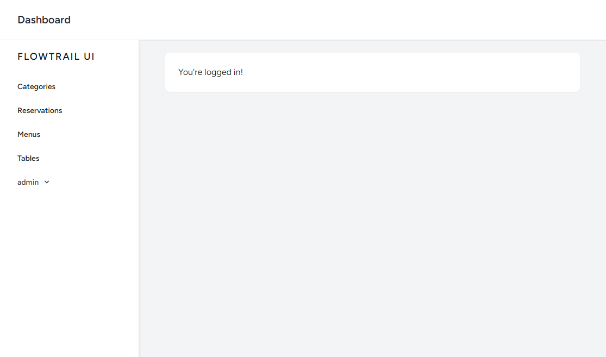
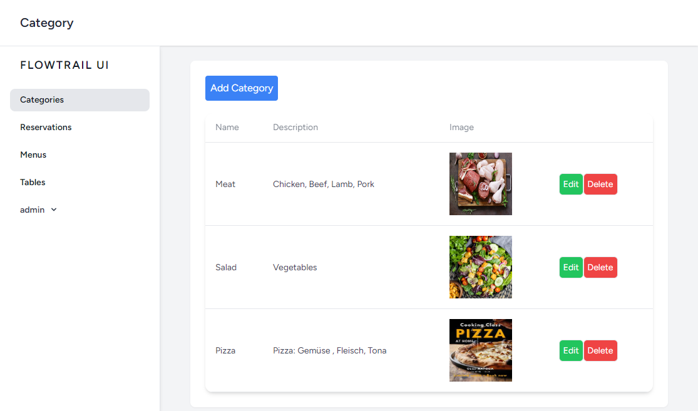
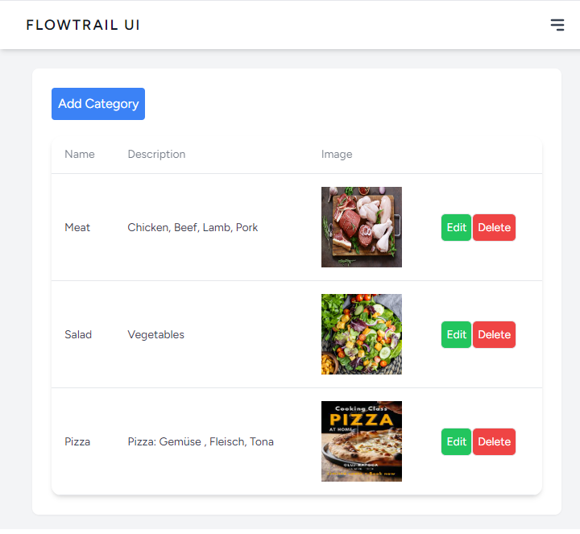
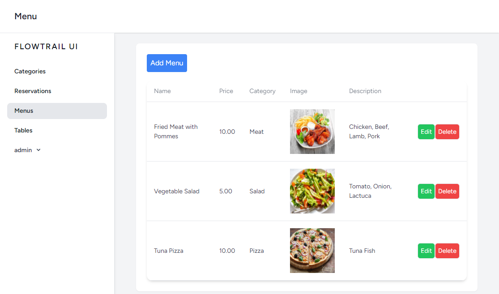
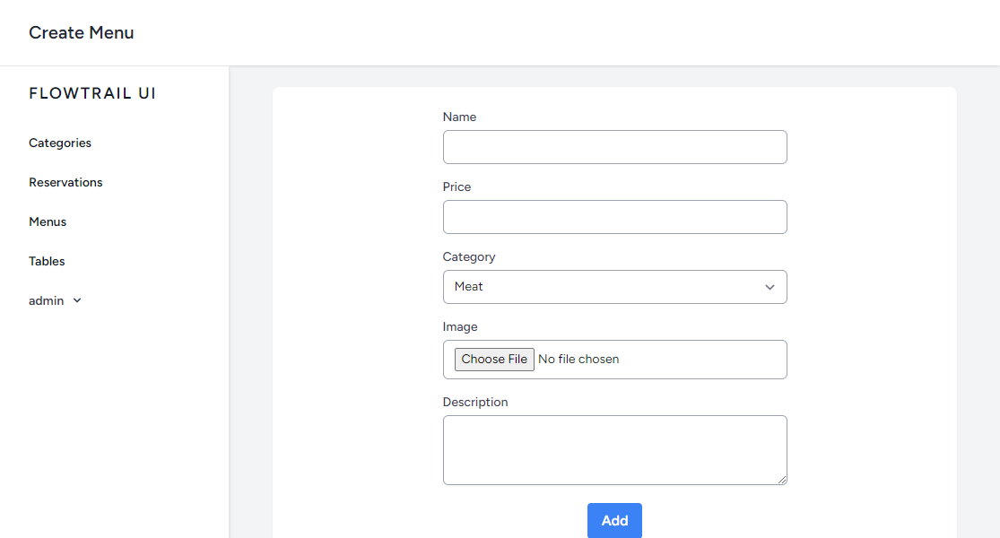
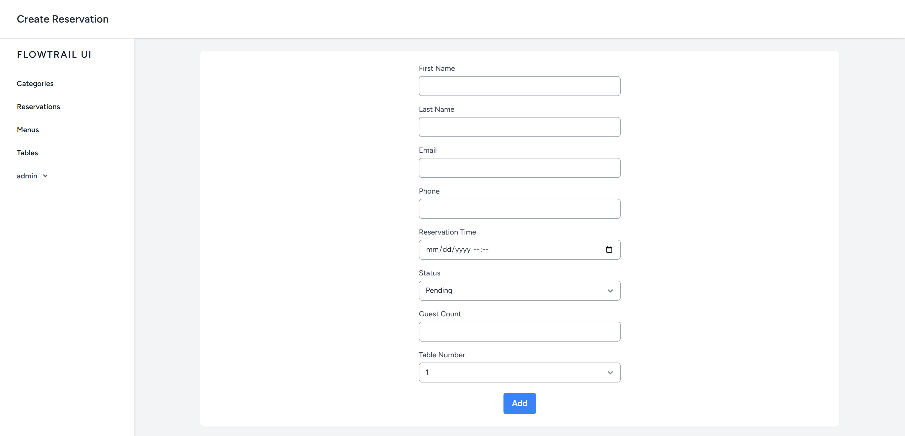
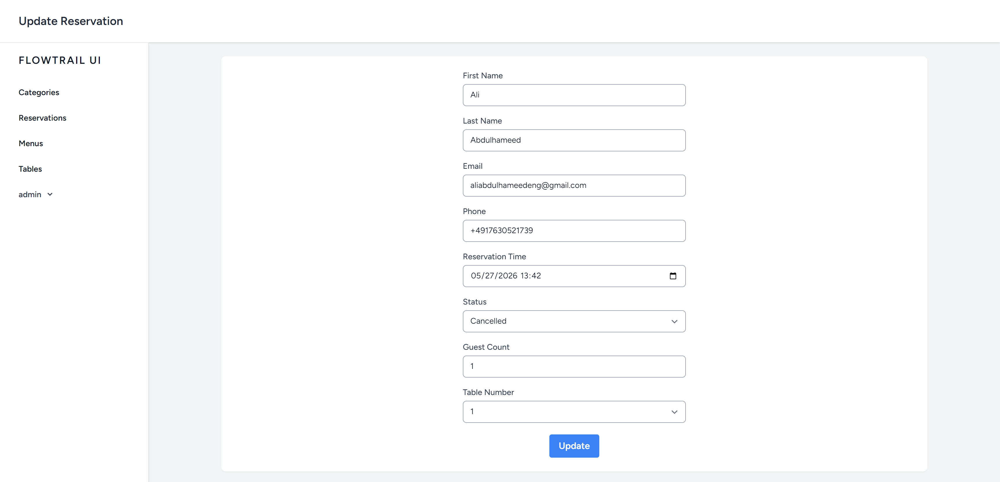
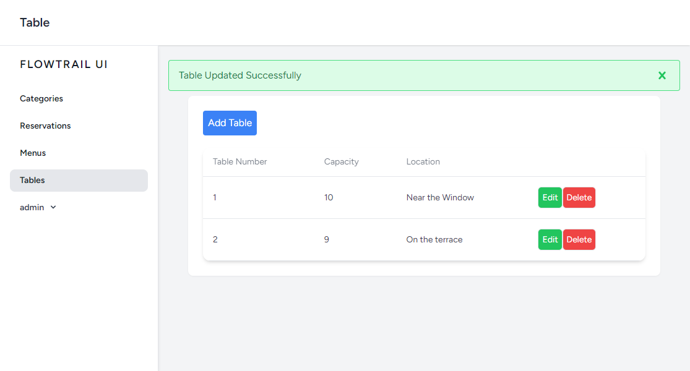
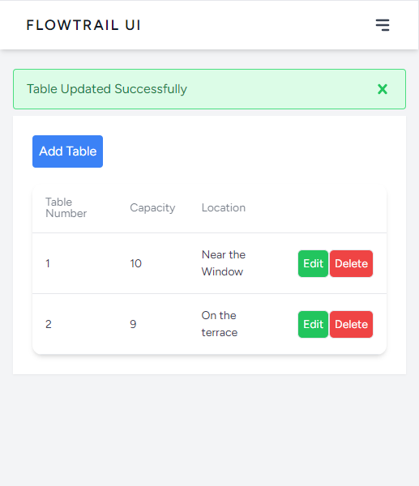

# Restaurant Reservation System

Restaurant reservation management system built with Laravel 11, PHP 8.2, and Tailwind CSS.

This project is designed as a professional portfolio project to demonstrate backend development skills, clean project structure, and real-world business logic using Laravel.

#### ( The Project is under development )

---

## Features

### User Side

- User registration and login
- Browse restaurant information
- Table reservation system
- Select reservation date and time
- Number of guests selection
- View personal reservations
- Reservation status tracking

---

### Admin Panel

- Admin dashboard
- Reservation management
- Table management
- Menu management
- Customer management
- Reservation approval and cancellation
- Admin-only access using middleware

---

## Screenshots

###  Admin Dashboard

##

###  Categories Index

##

###  Categories Index (Mobile Mode)

##

###  Menus Index

##

###  Add New Menu

##

###  Add New Reservation

##

###  Edit Reservation

##

###  Update success Message

##

###  Update success Message (Mobile Mode)

---

## Tech Stack

- PHP 8.2
- Laravel 11
- MySQL
- Blade
- Tailwind CSS
- Alpine.js
- Laravel Breeze
- Eloquent ORM
- Seeder for Admin User
- Custom Admin Middleware
- Git & GitHub

---

## Project Structure

- Separate Admin Controllers
- Admin Route Prefix
- Role-based Authorization
- Clean MVC Architecture
- Organized Blade Views
- Secure Authentication System

---

## Admin Access

Admin user is created using Seeder.

username: admin@gmail.com

password: 123

## Autor
Ali Abdulhameed.

May.2026